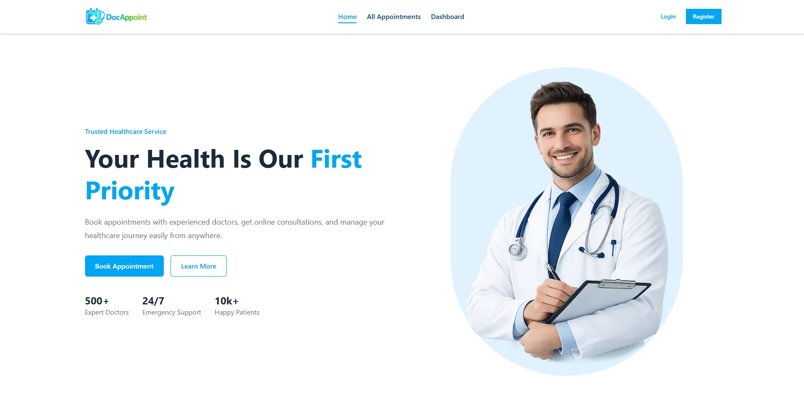
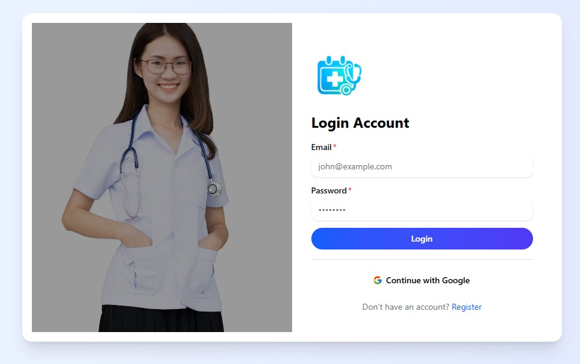
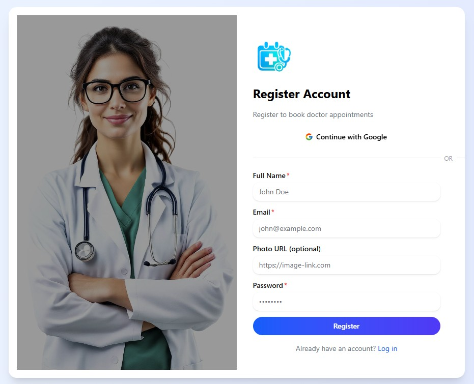

# 📚 Doctor Appointment App (Client)

A modern doctor appointment booking frontend built with Next.js, Tailwind CSS, and HeroUI.

## Features

- View doctors list
- Book appointments via modal
- Authentication support
- Form validation
- Smooth UI with animations
- Fully responsive design

## Tech Stack

- Next.js
- React
- Tailwind CSS
- HeroUI
- Framer Motion
- React Hot Toast

## Project Structure

```app/
components/
lib/
assets/
```
## ⚙️ Installation

```bash
git clone https://github.com/SamiaBaly/doctor-appointment-client
npm install
npm run dev

```
## 🌐Live Demo

- 👉 https://doctor-appointment-client-sigma.vercel.app/

## 🧪 Usage

- Open http://localhost:3000
- Browse and search doctor
- View doctor details
- Login to appointment doctor
- 
## 📸 Screenshots

### Home Page


### login


### Register


## 📌 Future Improvements

- ⭐ Doctor ratings & apooinments
- 📊 user dashboard
- 📅 Appointment history tracking
- 🔔 Notifications system

## 👨‍💻 Author

Developed by **Samia Baly**
